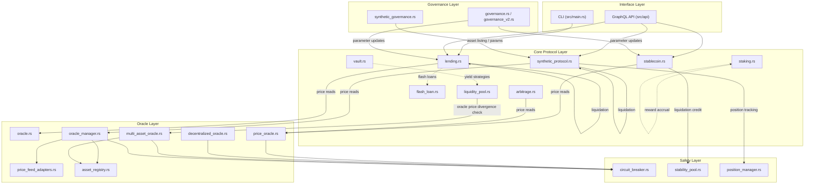
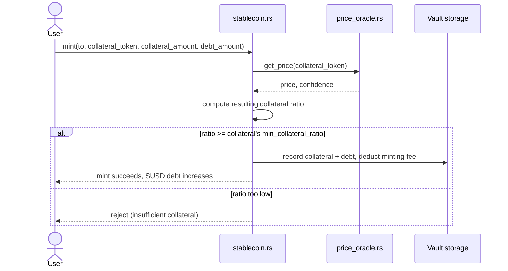
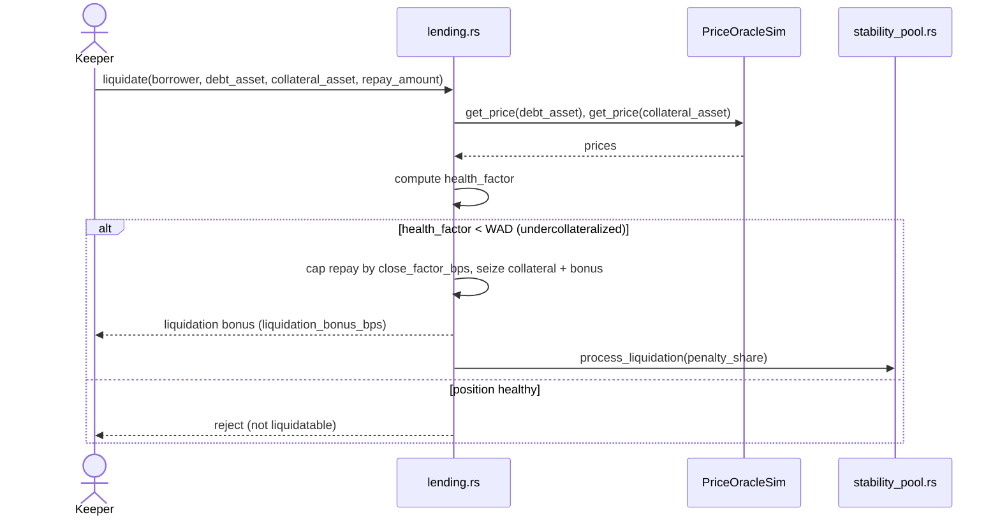
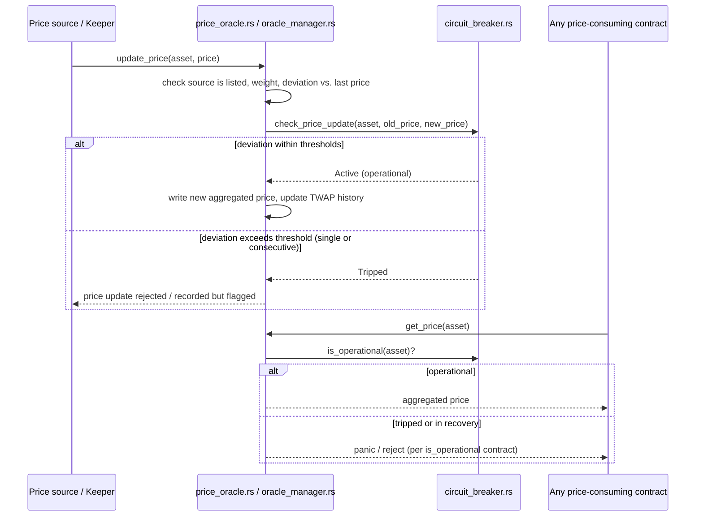
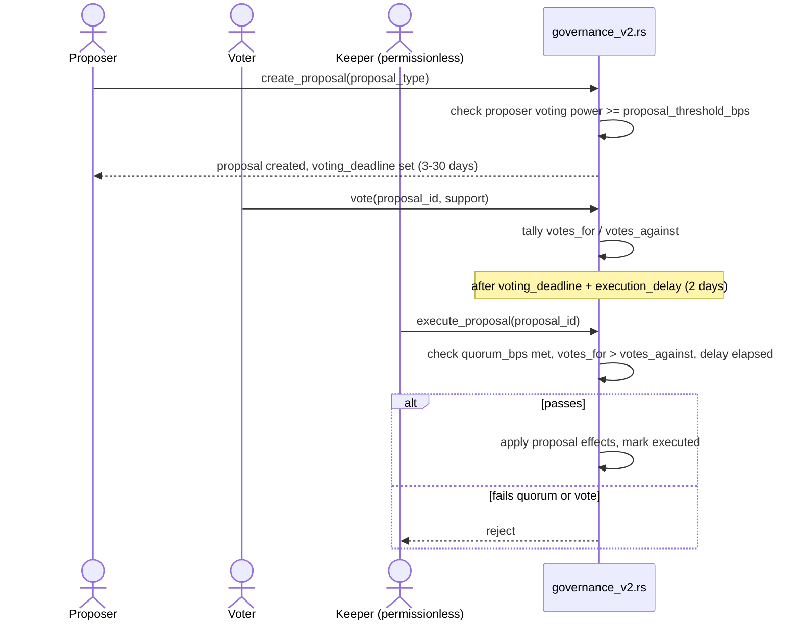

# Protocol Architecture

This document is the protocol-wide architecture reference: how the contracts fit
together, how the main user/keeper/governance flows move through them, the economic
model that drives fees and interest, and the risk parameters that bound the system.

Related documents:
- [`ACCESS_CONTROL_MATRIX.md`](ACCESS_CONTROL_MATRIX.md) — who can call what, per contract.
- [`SECURITY_AUDIT_CHECKLIST.md`](SECURITY_AUDIT_CHECKLIST.md) — threat model and audit checklist.
- [`stablecoin_economic_model.md`](stablecoin_economic_model.md) — stablecoin-specific economic deep dive.
- [`synthetic_protocol_risk_management.md`](synthetic_protocol_risk_management.md) — synthetic-asset-specific risk deep dive.
- [`staking_contract.md`](staking_contract.md), [`circuit_breaker_guide.md`](circuit_breaker_guide.md), [`CIRCUIT_BREAKER_V2_README.md`](CIRCUIT_BREAKER_V2_README.md) — per-module guides.

This document covers the protocol as a whole; it does not repeat what those documents
already cover in depth.

---

## 1. Architecture Overview

The toolkit is a collection of independent Soroban contracts (`src/contracts/`)
sharing common types (`src/types/`) and fixed-point math utilities
(`src/utils/fixed_point.rs`), exposed to off-chain consumers through a GraphQL API
(`src/api/`) and a CLI (`src/main.rs`). Contracts group into five layers:

1. **Oracle layer** — price discovery and validation, feeding every other layer.
2. **Core protocol layer** — the money-handling contracts: lending, stablecoin,
   synthetic assets, liquidity pools, yield vaults, staking.
3. **Safety layer** — circuit breakers and the stability pool, which sit between the
   oracle layer and the core protocols to absorb shocks.
4. **Governance layer** — parameter and upgrade control over the other layers.
5. **Interface layer** — the GraphQL API and CLI that expose protocol state and
   actions to off-chain clients.



**How to read this diagram:** solid arrows are direct read/write dependencies in the
current code; dashed arrows are conceptual/intended integrations. As documented in
[`ACCESS_CONTROL_MATRIX.md`](ACCESS_CONTROL_MATRIX.md), several of these
cross-contract calls (e.g. `stability_pool.rs::process_liquidation`,
`synthetic_protocol.rs::update_oracle_price`) are not yet gated to only accept calls
from their intended caller contract — treat the diagram as the intended data flow,
not a claim that every edge is access-controlled today.

---

## 2. Module Interaction Flows

### 2.1 Stablecoin minting



### 2.2 Liquidation (lending protocol)



### 2.3 Oracle aggregation and circuit breaker



### 2.4 Governance proposal lifecycle



> As noted in [`SECURITY_AUDIT_CHECKLIST.md`](SECURITY_AUDIT_CHECKLIST.md#governance-attacks),
> voting power in the current implementation is mocked/stubbed rather than derived
> from real token balances — the flow above describes the intended design, which the
> voting-power wiring has not yet caught up to.

---

## 3. Economic Model

### 3.1 Fixed-point conventions

All contracts share the fixed-point conventions in `src/utils/fixed_point.rs`:

| Constant | Value | Meaning |
|---|---|---|
| `WAD` | `1_000_000_000` (1e9) | Fixed-point unit for rates/ratios (e.g. `WAD` = 100% utilization) |
| `BPS_DENOMINATOR` | `10_000` | Basis points denominator (e.g. `500` bps = 5%) |
| `YEAR_IN_SECONDS` | `31_536_000` | Used to annualize per-second interest accrual |

`mul_div(a, b, denom) = (a * b) / denom` (checked, returns `Result` on overflow) is
the base primitive; `wad_mul`/`wad_div`/`bps_mul` are convenience wrappers over it.
Prefer these over raw arithmetic — see the overflow guidance in
[`SECURITY_AUDIT_CHECKLIST.md`](SECURITY_AUDIT_CHECKLIST.md#integer-overflow--underflow--precision-loss).

### 3.2 Lending interest rate model (`lending.rs`, `types/lending.rs`)

A standard two-slope, kinked utilization curve:

```
utilization = total_borrows / total_supply                     (WAD-scaled)

if utilization <= optimal_utilization:
    borrow_rate = base_rate + utilization * slope_1 / optimal_utilization

else:
    excess_utilization = utilization - optimal_utilization
    excess_capacity    = WAD - optimal_utilization
    borrow_rate = base_rate + slope_1
                  + excess_utilization * slope_2 / excess_capacity
```

Default parameters (`InterestRateModel::default()`), all WAD-scaled:

| Parameter | Value | As a rate |
|---|---|---|
| `base_rate` | `20_000_000` | 2% |
| `slope_1` | `80_000_000` | 8% (rate added as utilization rises to optimal) |
| `slope_2` | `1_200_000_000` | 120% (steep penalty slope above optimal utilization) |
| `optimal_utilization` | `800_000_000` | 80% |

**Rationale:** below 80% utilization, rates rise gently (2%→10%) to attract just
enough borrowing demand. Above 80%, the slope steepens sharply (up to 130%+ at 100%
utilization) to rapidly incentivize repayment/new deposits and protect withdrawal
liquidity — the standard Aave/Compound-style kink. Per-asset overrides are supported
via `set_asset_interest_rate_model`.

Supply-side yield is the protocol's borrow interest minus the `reserve_factor_bps`
protocol cut (`set_reserve_factor`, capped at 10,000 bps / 100%).

### 3.3 Stablecoin economic model (`stablecoin.rs`)

Fully detailed in [`stablecoin_economic_model.md`](stablecoin_economic_model.md).
Summary of the core parameters:

| Parameter | Value |
|---|---|
| Minimum collateral ratio | 110% |
| Default collateral ratio | 150% |
| Maximum collateral ratio | 500% |
| Min / max debt per vault | 100 / 10,000 SUSD |
| Minting / redemption fee | 0.5% / 0.5% (capped at 10% each by `set_minting_fee`/`set_redemption_fee`) |
| Liquidation penalty | 10% |
| Stability pool reward | ~5% APY (governance-tunable) |
| Arbitrage reward | 0.5%–2%, sliding with deviation severity |

### 3.4 Synthetic asset protocol (`synthetic_protocol.rs`)

Risk-parameter deep dive in
[`synthetic_protocol_risk_management.md`](synthetic_protocol_risk_management.md).
Key mechanics: over-collateralized minting against a configurable
`min_collateral_ratio`/`max_collateral_ratio` per asset, liquidation once
`current_ratio < liquidation_threshold` (10% penalty, split 90/10 between liquidator
and the position owner), and a minting fee capped at 10% by `update_risk_params`.
Oracle confidence must be ≥ 80% (`8000`/`10000`) for any price-dependent action.

### 3.5 Staking rewards (`staking.rs`)

Fixed lock-up-duration tiers, each with its own APY, configured via `set_tier`:

| Lock-up | Default APY |
|---|---|
| 0 days (flexible) | 2% |
| 30 days | 5% |
| 90 days | 10% |
| 365 days | 25% |

Rewards accrue linearly over elapsed time at the tier's APY and are paid out
alongside principal on `withdraw`, which reverts if called before
`start_time + lock_up_duration` has elapsed.

### 3.6 Liquidity pool fees (`liquidity_pool.rs`)

Constant-product AMM (`x * y = k`) with a 0.3% swap fee baked into
`swap`/`swap_a_for_b`/`swap_b_for_a`, collected pro-rata to LP share on
`claim_fees`. Slippage protection is caller-supplied (`min_out`/`in_max`).

### 3.7 Flash loans and arbitrage

`flash_loan.rs` charges a default fee of 9 bps (0.09%) on the borrowed amount
(`set_fee`, capped at 1000 bps / 10%); `lending.rs::flash_loan` charges the
per-asset `flash_loan_fee_bps` configured on that reserve. `arbitrage.rs` rewards
detected/executed arbitrage on a sliding scale (0.5%–2%) proportional to deviation
severity, bounded by `min_deviation_bps`/`max_deviation_bps` (default 10–500 bps).

---

## 4. Risk Parameters

This section consolidates the risk-relevant configuration knobs across contracts.
For the full rationale behind synthetic-asset and stablecoin parameters specifically,
see the dedicated documents linked in Section 3.

| Contract | Parameter | Default / Bound | Rationale |
|---|---|---|---|
| `lending.rs` | `supply_cap` / `borrow_cap` per asset | 0 = uncapped, admin-set | Bounds protocol exposure to any single asset; a cap of 0 is an explicit "no limit" choice, not an unset default. |
| `lending.rs` | `close_factor_bps` | admin-set | Limits how much of a position can be liquidated in one call, preventing over-liquidation griefing. |
| `lending.rs` | `reserve_factor_bps` | ≤ 10,000 bps | Protocol's cut of borrow interest; funds treasury/insurance without starving supplier yield. |
| `stablecoin.rs` | `min_collateral_ratio` per collateral type | ≥ 110% | Floor below which a position is immediately liquidatable; set above 100% to absorb price-feed latency and liquidation slippage. |
| `stablecoin.rs` | `max_collateral_ratio` per collateral type | ≤ 500% | Prevents pathological configuration that would make an asset unusable as collateral. |
| `stablecoin.rs` | Minting/redemption fee | ≤ 1000 bps (10%) | Caps admin's ability to set punitive fees; revenue lever bounded for user protection. |
| `synthetic_protocol.rs` | `min_collateral_ratio` (global floor via `update_risk_params`) | admin-set floor | Prevents governance/admin from setting protocol-wide ratios below a safe minimum. |
| `synthetic_protocol.rs` | Oracle confidence floor | ≥ 8000/10000 (80%) | Rejects mint/burn/liquidation actions during periods of low oracle confidence. |
| `circuit_breaker.rs` | Single-update deviation threshold | 1000 bps (10%) | Trips the breaker on a single large price jump — the classic oracle-manipulation signature. |
| `circuit_breaker.rs` | Consecutive-deviation threshold | 3 updates > 5% | Catches slower manipulation/ramp attacks that stay under the single-update threshold. |
| `decentralized_oracle.rs` | `MIN_STAKE` per oracle | admin-set | Raises the cost of registering a malicious oracle (Sybil resistance via bonding). |
| `decentralized_oracle.rs` | `SLASH_PERCENTAGE` | 10% | Penalizes a misbehaving oracle's stake on `slash_oracle`. |
| `decentralized_oracle.rs` | `UNBONDING_PERIOD` | 7 days | Delays stake withdrawal so slashing can still be applied to recently-misbehaving oracles. |
| `governance_v2.rs` / `synthetic_governance.rs` | `voting_period` | 3–30 days (default 7) | Balances responsiveness against giving token holders enough time to notice and vote. |
| `governance_v2.rs` / `synthetic_governance.rs` | `quorum_bps` | 5%–50% (default 10%) | Prevents low-turnout proposals from passing while remaining achievable. |
| `governance_v2.rs` / `synthetic_governance.rs` | `execution_delay` | 2 days | Timelock giving users an exit window between a proposal passing and taking effect. |
| `vault.rs` | `MAX_PERFORMANCE_FEE_BPS` | 30% | Caps the admin's yield-farming performance fee take. |
| `vault.rs` | `MIN_HARVEST_INTERVAL` | 1 hour | Rate-limits harvest calls to bound gas/keeper-spam griefing. |
| `asset_registry.rs` | `MAX_ASSETS`, `MAX_SOURCES_PER_ASSET` | 1000, 10 | Bounds unbounded storage growth (see DoS guidance in the security checklist). |

**Important caveat:** several of the parameters above are only as strong as their
enforcement. Where [`ACCESS_CONTROL_MATRIX.md`](ACCESS_CONTROL_MATRIX.md) flags a
contract's admin check as broken, the corresponding risk parameters in that contract
can currently be changed by anyone (or by no one, if the check always fails) rather
than only by governance/admin as designed. Risk parameter design and access control
enforcement are two independent concerns — this document covers the former; treat
the latter as tracked separately.

---

## 5. Where This Fits With the Rest of the Docs

| Document | Answers |
|---|---|
| This document | How are the contracts wired together, and what are the economic/risk parameters? |
| [`ACCESS_CONTROL_MATRIX.md`](ACCESS_CONTROL_MATRIX.md) | Who can call which function, and is that actually enforced? |
| [`SECURITY_AUDIT_CHECKLIST.md`](SECURITY_AUDIT_CHECKLIST.md) | What attack classes apply, and what's the current known-findings list? |
| [`stablecoin_economic_model.md`](stablecoin_economic_model.md), [`synthetic_protocol_risk_management.md`](synthetic_protocol_risk_management.md), [`staking_contract.md`](staking_contract.md), [`circuit_breaker_guide.md`](circuit_breaker_guide.md) | Deep dives on a single module. |
